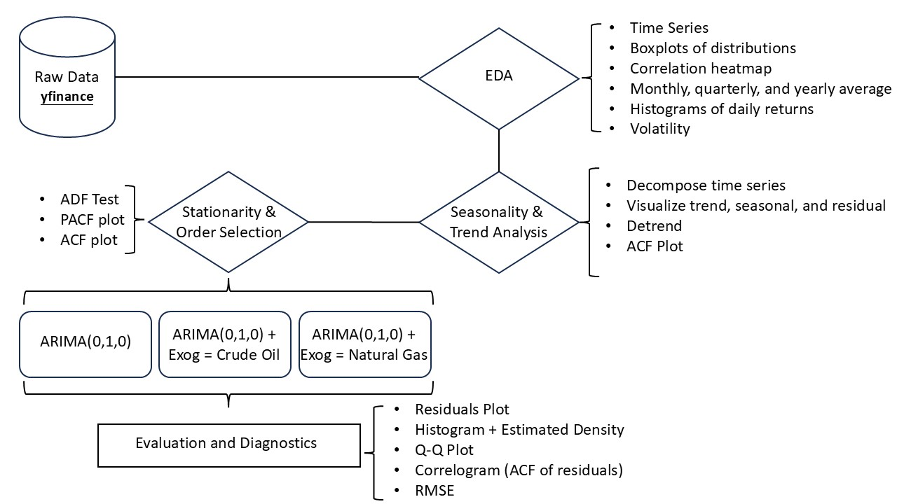

# ⚡ Energy Stock Analysis

This project analyzes the stock performance of major energy companies and their relationship with crude oil and natural gas prices. It leverages historical data from Yahoo Finance and applies time series analysis techniques (including ARIMA modeling) to visualize trends, explore statistical properties, and generate short-term forecasts.

## 📈 Companies & Commodities Analyzed

- **Companies:**
  - Shell (SHEL)
  - ExxonMobil (XOM)
  - BP (BP)
  - Chevron (CVX)
  
- **Commodities:**
  - Crude Oil (CL=F)
  - Natural Gas (NG=F)

## 🔧 Tools & Libraries

- `pandas`, `numpy` — Data manipulation
- `yfinance` — Stock price scraping
- `matplotlib`, `seaborn` — Data visualization
- `statsmodels` — Time series modeling (ARIMA, seasonal decomposition, ADF test, ACF/PACF)
- `sklearn` — RMSE metric
- `tqdm` — Progress bar for loops

## 📁 Project Structure

```bash
Energy-Stock/
│
├── data/                        
│
├── plots/                       
│   ├── histogram_of_daily_price_changes_for_all_stocks.png
│   ├── correlation_matrix.png
│   └── predictions/             
│       ├── SHEL_ARIMA_forecast.png
│       ├── XOM_ARIMA_forecast.png
│       └── ...
│
├── stock_analysis.ipynb        
├── stock_analysis.py           
├── requirements.txt            
├── .gitignore                  
└── README.md                   
```

## 🔄 Project Workflow


## 🧠 Key Features

### 1. **Data Collection**
- Uses `yfinance` to retrieve daily stock price data from 2021 to present.
- Prepares and merges data for major energy companies and fossil fuel commodities.

### 2. **Exploratory Data Analysis (EDA)**
- Line plots for daily closing prices and volumes
- Monthly, quarterly, and yearly trends
- Volatility analysis (standard deviation of daily returns)
- Correlation heatmaps across all tickers

### 3. **Seasonal Decomposition**
- Applies seasonal decomposition to Shell and Chevron to reveal:
  - Trend
  - Seasonality
  - Residual

### 4. **Stationarity Testing**
- Conducts **ADF test** and visualizes **ACF/PACF** plots to determine differencing order for ARIMA.

### 5. **Forecasting with ARMA**
- Fits and evaluates **ARIMA(0,1,0)** models.
- Forecasts next 30 days of stock prices.
- Includes:
  - Forecast vs. actual plot with confidence intervals
  - Model diagnostics

### 6. **ARMA Model with Train-Test Validation**
- Splits data into 80% train / 20% test.
- Evaluates model performance using **Root Mean Squared Error (RMSE)**.

### 7. **ARMAX Model**
- Uses **crude oil** and **natural gas** prices as exogenous inputs (ARIMAX).
- Compares forecasting performance with and without external variables.

## ▶️ Getting Started

1. **Clone this repository:**
```bash
git clone https://github.com/Yingtzudai/Energy-Stock.git
cd Energy-Stock
```

2. **Install dependencies:**
```bash
pip install -r requirements.txt
```

3. **Run the notebook:**
Open `Energy_Stock_Analysis.ipynb` in Jupyter or VS Code.